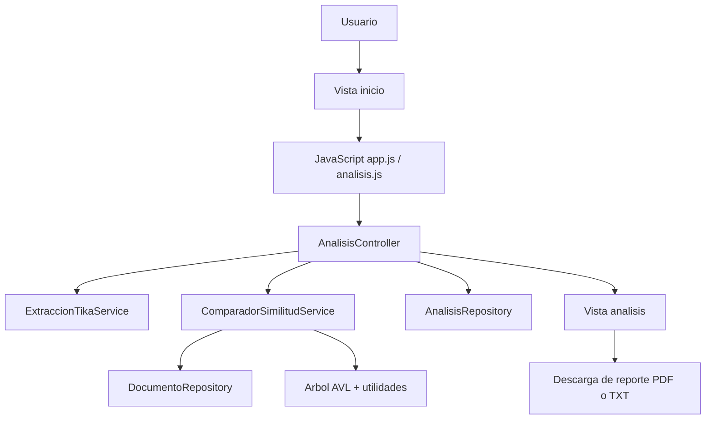
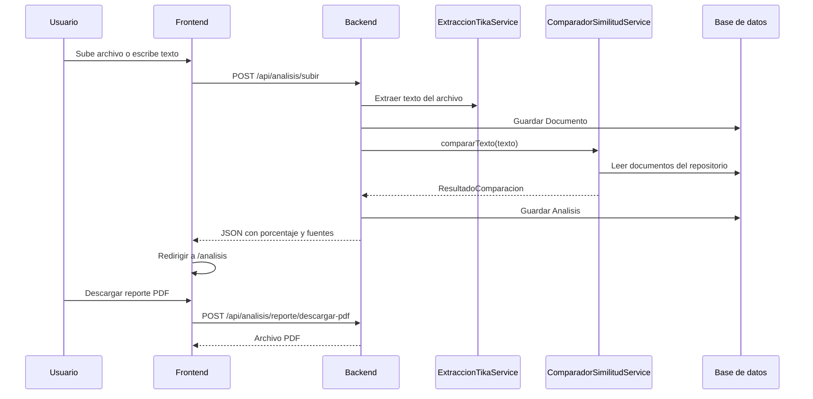

# Documentación del sistema Eidox

## 1. Propósito del sistema

Eidox es una aplicación web desarrollada con Spring Boot, Thymeleaf y JavaScript que permite analizar documentos y texto escrito para detectar similitudes con el repositorio local de documentos almacenados en la base de datos.

El objetivo principal del sistema es ayudar a identificar posible plagio u originalidad baja en un contenido, mostrando de forma visual:

- el porcentaje final de similitud,
- el porcentaje estimado de contenido original,
- las fuentes encontradas,
- los fragmentos coincidentes dentro del texto analizado,
- y un reporte descargable en formato PDF o texto.

## 2. Vista general de la arquitectura

El proyecto sigue una arquitectura web clásica por capas:

- Capa de presentación: HTML, Thymeleaf, CSS y JavaScript.
- Capa de control: controladores Spring MVC y REST.
- Capa de servicio: lógica de extracción, tokenización y comparación.
- Capa de persistencia: entidades JPA y repositorios.
- Capa de soporte: estructuras de datos auxiliares, utilidades y cargadores de datos.



## 3. Flujo funcional completo

El recorrido del sistema se entiende mejor en este orden:

1. El usuario entra a la página principal.
2. En la sección de análisis, sube un archivo PDF o DOCX, o pega texto manual.
3. El frontend valida que exista contenido suficiente.
4. El formulario se envía por `fetch` al backend.
5. El backend extrae el texto del archivo o usa el texto manual.
6. El documento se guarda en la base de datos.
7. El servicio de comparación analiza el texto contra el repositorio local.
8. El backend devuelve un JSON con el porcentaje de similitud y las fuentes encontradas.
9. El frontend redirige a la vista de resultados.
10. La vista de resultados renderiza el análisis de forma visual.
11. El usuario puede descargar el reporte detallado en PDF.



## 4. Tecnologías utilizadas

### Backend

- Java 21
- Spring Boot 4
- Spring Web MVC
- Spring Data JPA
- Spring Security
- Thymeleaf
- Apache Tika
- OpenPDF

### Frontend

- HTML5
- CSS3
- JavaScript nativo
- Bootstrap 5
- Bootstrap Icons

### Persistencia

- MySQL o el motor configurado en `application.properties`

## 5. Estructura del proyecto

### Paquetes principales

- `config`: configuración de seguridad y carga de datos iniciales.
- `controller`: controladores web y REST.
- `model`: entidades JPA.
- `repository`: acceso a datos.
- `service`: lógica principal del negocio.
- `service.dto`: objetos de transferencia de datos.
- `estructura`: estructuras auxiliares como AVL.
- `util`: utilidades de búsqueda y ordenamiento.

## 6. Punto de entrada de la aplicación

Archivo: [src/main/java/utp/eidox/PlagiodetectApplication.java](src/main/java/utp/eidox/PlagiodetectApplication.java)

Este archivo contiene la clase principal con `@SpringBootApplication`. Su función es iniciar toda la aplicación Spring Boot.

```java
SpringApplication.run(PlagiodetectApplication.class, args);
```

En una exposición puedes explicarlo así:

- es el arranque del sistema,
- carga el contexto de Spring,
- detecta beans, controladores, servicios y repositorios,
- y levanta el servidor web.

## 7. Seguridad

Archivo: [src/main/java/utp/eidox/config/ConfiguracionSecurity.java](src/main/java/utp/eidox/config/ConfiguracionSecurity.java)

La configuración de seguridad actualmente permite todo el acceso sin autenticación y desactiva CSRF.

Eso significa que:

- cualquier ruta se puede consultar sin iniciar sesión,
- el sistema está en modo abierto mientras se desarrolla,
- el flujo de análisis funciona sin barreras de autenticación.

Para exposición, esto se puede explicar como una decisión de desarrollo para facilitar pruebas internas y prototipado.

## 8. Carga inicial de datos

Archivo: [src/main/java/utp/eidox/config/CargadorDatosIniciales.java](src/main/java/utp/eidox/config/CargadorDatosIniciales.java)

Este componente hace dos tareas al arrancar:

### 8.1 Ajuste automático de base de datos

Comprueba si existe la tabla `analisis` y si la columna `referencias_encontradas` es `LONGTEXT`.

Si no lo es, intenta corregirla automáticamente.

Esto es útil porque el sistema guarda en esa columna el JSON serializado de las fuentes encontradas.

### 8.2 Documentos de ejemplo

Si el repositorio de documentos está vacío, inserta varios documentos de muestra.

Esto permite que el motor de similitud tenga una base sobre la que comparar desde el primer arranque.

En una exposición puedes decir que este cargador asegura que la aplicación sea demostrable sin depender de datos manuales previos.

## 9. Entidades del dominio

### 9.1 Documento

Archivo: [src/main/java/utp/eidox/model/Documento.java](src/main/java/utp/eidox/model/Documento.java)

Representa cualquier archivo o texto que el sistema almacena para compararlo después.

Campos importantes:

- `idDocumento`: identificador único.
- `nombreArchivo`: nombre original del archivo o nombre generado para texto manual.
- `tipoMime`: tipo MIME del contenido.
- `contenidoTexto`: texto extraído del archivo o escrito por el usuario.
- `fechaCarga`: fecha de inserción.
- `usuario`: relación con el usuario propietario.

### 9.2 Analisis

Archivo: [src/main/java/utp/eidox/model/Analisis.java](src/main/java/utp/eidox/model/Analisis.java)

Guarda el resultado resumido del análisis.

Campos importantes:

- `porcentaje`: porcentaje final de plagio o similitud.
- `referenciasEncontradas`: JSON con las fuentes detectadas.
- `fechaAnalisis`: fecha en que se ejecutó el análisis.
- `usuario`: usuario asociado.

### 9.3 Usuario

La entidad `Usuario` representa el propietario de documentos y análisis. En este proyecto se usa un usuario predeterminado para facilitar el flujo sin autenticación completa.

## 10. Repositorios

### DocumentoRepository

Archivo: [src/main/java/utp/eidox/repository/DocumentoRepository.java](src/main/java/utp/eidox/repository/DocumentoRepository.java)

Permite guardar y consultar documentos.

### AnalisisRepository

Archivo: [src/main/java/utp/eidox/repository/AnalisisRepository.java](src/main/java/utp/eidox/repository/AnalisisRepository.java)

Permite almacenar análisis y listarlos por usuario y fecha descendente.

La idea general de los repositorios es sencilla:

- se encargan de acceso a datos,
- no contienen lógica del negocio,
- y simplifican la lectura/escritura en base de datos.

## 11. Controladores

### 11.1 HomeController

Archivo: [src/main/java/utp/eidox/controller/homeController.java](src/main/java/utp/eidox/controller/homeController.java)

Define las rutas de las páginas HTML principales:

- `/` y `/inicio` -> vista principal.
- `/analisis` -> vista de resultados.

Este controlador no procesa lógica compleja, solo resuelve qué plantilla mostrar.

### 11.2 AnalisisController

Archivo: [src/main/java/utp/eidox/controller/AnalisisController.java](src/main/java/utp/eidox/controller/AnalisisController.java)

Es el corazón del flujo de análisis.

#### Endpoint principal: `/api/analisis/subir`

Recibe:

- un archivo subido,
- o texto manual.

Luego:

1. valida contenido,
2. extrae texto,
3. guarda el documento,
4. compara contra el repositorio,
5. guarda el análisis,
6. devuelve un JSON con resultados.

#### Endpoint de reporte TXT: `/api/analisis/reporte/descargar`

Genera un archivo de texto con:

- fecha,
- documento analizado,
- porcentaje de similitud,
- contenido original estimado,
- lista de fuentes.

#### Endpoint de reporte PDF: `/api/analisis/reporte/descargar-pdf`

Genera un PDF visual con tabla de fuentes y resumen ejecutivo.

En exposición, este controlador se puede describir como la pieza que une frontend, servicios y persistencia.

## 12. Servicios

### 12.1 ExtraccionTikaService

Archivo: [src/main/java/utp/eidox/service/ExtraccionTikaService.java](src/main/java/utp/eidox/service/ExtraccionTikaService.java)

Su función es leer el archivo cargado y convertirlo a texto plano.

Usa Apache Tika para soportar diferentes formatos sin escribir parsers manuales.

Explicación simple:

- el usuario sube un PDF o DOCX,
- Tika detecta el formato,
- extrae el contenido textual,
- y ese texto pasa al motor de comparación.

### 12.2 ComparadorSimilitudService

Archivo: [src/main/java/utp/eidox/service/ComparadorSimilitudService.java](src/main/java/utp/eidox/service/ComparadorSimilitudService.java)

Este servicio ejecuta la lógica de detección de coincidencias.

#### Idea general del algoritmo

El documento se tokeniza, luego se generan n-gramas de tamaño 5. Después:

- se construye un índice con los documentos del repositorio,
- se busca cada n-grama en ese índice,
- se acumulan coincidencias por fuente,
- y finalmente se calcula el porcentaje de similitud.

#### Componentes internos usados

- `PlagioService`: tokenización y generación de n-gramas.
- `OrdenadorQuicksort`: ordenamiento de n-gramas.
- `BuscadorBinario`: apoyo para búsquedas auxiliares.
- `ArbolAVL`: índice de coincidencias.

#### Qué devuelve

Retorna un objeto `ResultadoComparacion` con:

- `porcentajePlagio`
- `totalPalabras`
- `textoOriginal`
- `fuentes`

#### Explicación para exposición

El motor no hace una comparación de documento completo solamente. En su lugar, divide el texto en fragmentos pequeños, busca coincidencias y agrupa resultados por fuente. Eso le da más precisión para mostrar exactamente qué parte coincidió y con qué documento.

## 13. Objetos de transferencia de datos

### ResultadoComparacion

Archivo: [src/main/java/utp/eidox/service/dto/ResultadoComparacion.java](src/main/java/utp/eidox/service/dto/ResultadoComparacion.java)

Es el paquete principal de salida del análisis.

### FuenteCoincidencia

Archivo: [src/main/java/utp/eidox/service/dto/FuenteCoincidencia.java](src/main/java/utp/eidox/service/dto/FuenteCoincidencia.java)

Describe una fuente encontrada:

- nombre,
- tipo,
- URL o referencia,
- porcentaje aportado,
- fragmento coincidente,
- lista de fragmentos hallados en el texto.

## 14. Estructuras de datos y utilidades

Aunque el usuario no las ve directamente, estas piezas son importantes para explicar el rendimiento del sistema.

### ArbolAVL

Se usa como índice para búsquedas ordenadas y rápidas de n-gramas.

### OrdenadorQuicksort

Ordena la lista de n-gramas antes de construir o consultar estructuras internas.

### BuscadorBinario

Apoya búsquedas eficientes sobre listas ordenadas.

### Razón de su uso

Estas estructuras ayudan a que el análisis no sea una simple comparación lineal, sino un proceso más organizado y escalable.

## 15. Interfaz de usuario principal

### 15.1 Vista de inicio

Archivo: [src/main/resources/templates/pages/inicio.html](src/main/resources/templates/pages/inicio.html)

Contiene:

- hero principal,
- sección de análisis,
- cargador de archivo,
- textarea para texto manual,
- contador de palabras,
- barra de progreso,
- botón de análisis.

#### Qué hace la sección de análisis

Permite dos entradas:

- archivo PDF/DOCX,
- texto manual con al menos 70 palabras.

### 15.2 Vista de resultados

Archivo: [src/main/resources/templates/pages/analisis.html](src/main/resources/templates/pages/analisis.html)

Muestra:

- porcentaje de plagio,
- porcentaje de originalidad,
- fuentes encontradas,
- texto resaltado con coincidencias,
- desglose visual por fuente,
- botón para descargar reporte PDF,
- botón para nuevo análisis.

## 16. JavaScript de interacción

### 16.1 app.js

Archivo: [src/main/resources/static/js/app.js](src/main/resources/static/js/app.js)

Este archivo controla la experiencia general de la página de inicio:

- tema oscuro/claro,
- menú móvil,
- partículas decorativas,
- efecto parallax,
- aparición de secciones al hacer scroll,
- contador de palabras,
- validación de entrada,
- carga y limpieza de archivo.

#### Función clave: iniciarAreaTexto

Valida que el texto tenga al menos 70 palabras.

#### Función clave: iniciarSubidaArchivo

Maneja:

- selección del archivo,
- validación de tipo MIME,
- bloqueo del textarea si hay archivo,
- limpieza del archivo si se quita.

### 16.2 analisis.js

Archivo: [src/main/resources/static/js/analisis.js](src/main/resources/static/js/analisis.js)

Este archivo se encarga de renderizar la vista de resultados.

#### Qué hace

- recibe el JSON del backend,
- actualiza contadores,
- anima el medidor circular,
- pinta barras de desglose,
- construye la lista de fuentes,
- resalta fragmentos coincidentes en el texto,
- guarda el resultado en `sessionStorage`,
- recupera el resultado al entrar a `/analisis`,
- descarga el reporte PDF desde el backend.

#### Renderizado del texto

Cuando llega una fuente con fragmentos coincidentes, el script reemplaza esas porciones dentro del texto por etiquetas resaltadas con colores dinámicos. Eso le da al usuario una lectura visual de dónde ocurrió la coincidencia.

#### Descarga del reporte

Al pulsar el botón de descarga:

1. Se toma el análisis actual.
2. Se manda al backend.
3. El backend responde con un PDF.
4. El navegador lo descarga automáticamente.

## 17. Generación de reporte

Actualmente el sistema tiene dos formatos de descarga:

- TXT para una lectura rápida.
- PDF para una presentación más profesional.

### Qué contiene el reporte PDF

- título principal,
- fecha de generación,
- nombre del documento,
- porcentaje final de similitud,
- porcentaje original estimado,
- total de palabras,
- total de fuentes encontradas,
- tabla con referencias de cada fuente.

### Por qué es útil para una exposición

Porque permite mostrar no solo la detección, sino también la evidencia y la trazabilidad de los resultados.

## 18. Explicación del algoritmo en lenguaje sencillo

Si necesitas explicarlo frente a un público, puedes decirlo así:

1. El sistema toma el texto del usuario.
2. Lo divide en palabras y construye fragmentos de 5 palabras.
3. Hace lo mismo con los documentos guardados en la base local.
4. Busca fragmentos iguales o muy parecidos.
5. Suma las coincidencias por fuente.
6. Calcula el porcentaje final de similitud.
7. Devuelve al usuario un informe visual y descargable.

## 19. Puntos fuertes del sistema

- No depende de servicios externos para comparar documentos.
- Usa el repositorio local como base de conocimiento.
- Muestra resultados visuales claros.
- Permite analizar archivo o texto manual.
- Genera reporte descargable para evidencia.
- Tiene datos de ejemplo para facilitar demostración.

## 20. Limitaciones actuales

- La seguridad está abierta para desarrollo.
- El análisis depende del contenido disponible en la base local.
- La calidad del resultado mejora si el repositorio tiene más documentos.
- El reporte PDF es funcional, pero todavía puede enriquecerse con gráficos o portada.

## 21. Idea de mejora futura

- Agregar autenticación real.
- Guardar relación explícita entre análisis y documento para historiales más completos.
- Exportar reportes con diseño más formal.
- Añadir comparación semántica, no solo por n-gramas.
- Crear historial de análisis por usuario.

## 22. Guion breve para exposición

Si quieres presentarlo oralmente, puedes resumirlo así:

"Eidox es un sistema web para detectar similitud entre un documento nuevo y un repositorio local de documentos. El usuario puede subir un archivo o escribir texto manualmente. El backend extrae el contenido, lo tokeniza, genera n-gramas y compara esos fragmentos con los documentos almacenados. Después calcula un porcentaje de similitud y muestra las fuentes encontradas de forma visual. Además, el sistema genera un reporte PDF descargable con el resultado detallado, lo que facilita la revisión y la presentación de evidencias."
