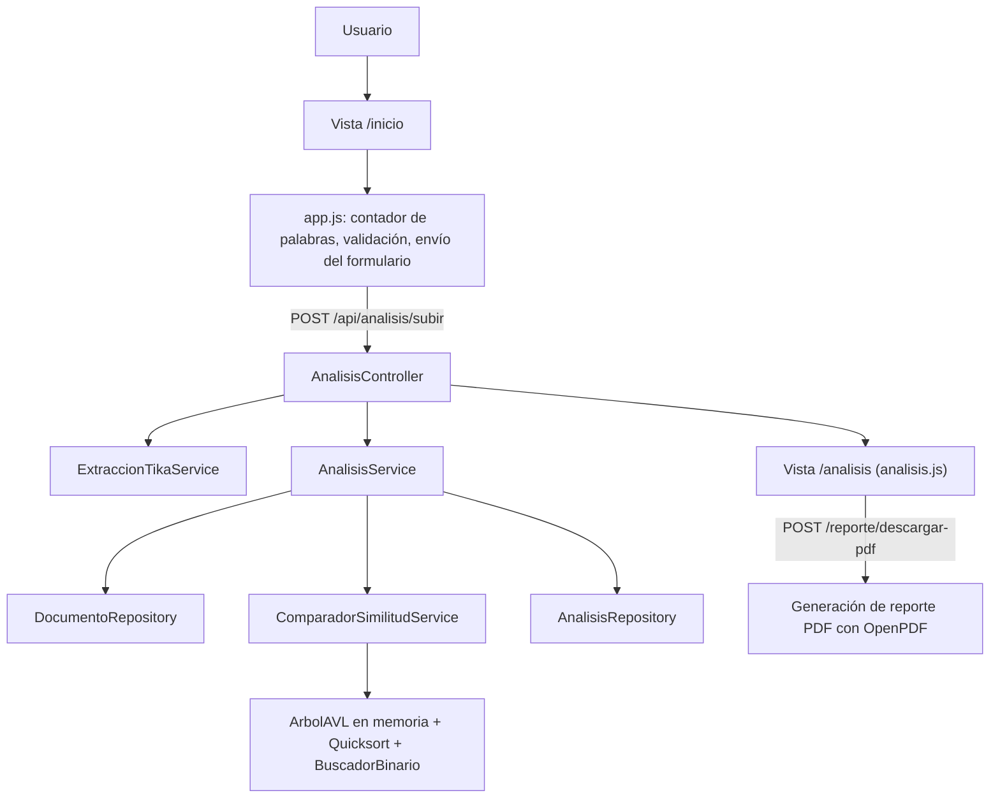
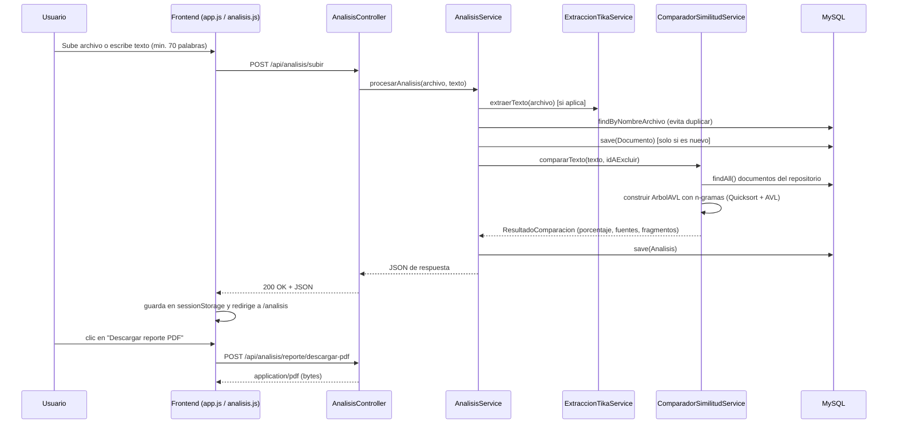
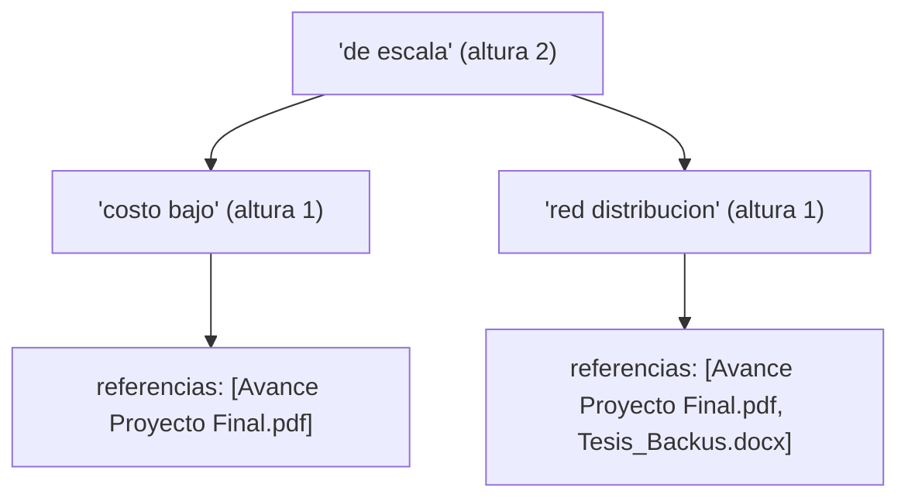

# Documentación del Eidox | Detector de plagio

> Última sincronización con el proyecto terminado

## 1. Propósito del sistema

Eidox es una aplicación web desarrollada con Spring Boot, Thymeleaf y JavaScript que permite analizar documentos y texto escrito para detectar similitudes con un repositorio local de documentos almacenados en MySQL.

El objetivo principal del sistema es ayudar a identificar posible plagio u originalidad baja en un contenido, mostrando de forma visual:

- el porcentaje final de similitud ,
- el porcentaje estimado de contenido original,
- las fuentes encontradas en el repositorio local, con su propio porcentaje de aporte,
- los fragmentos coincidentes resaltados dentro del texto analizado,
- y un reporte descargable en PDF con tabla de fuentes.

## 2. Vista general de la arquitectura

El proyecto sigue una arquitectura web clásica por capas:

- **Presentación**: HTML + Thymeleaf, CSS y JavaScript nativo (sin framework SPA).
- **Control**: un controlador MVC (`homeController`) para las vistas, y un controlador REST (`AnalisisController`) para el flujo de análisis.
- **Servicio**: extracción de texto, tokenización, comparación por n-gramas y generación de reportes PDF.
- **Persistencia**: entidades JPA (`Usuario`, `Documento`, `Analisis`) sobre MySQL.
- **Soporte / estructuras de datos**: `ArbolAVL`, `OrdenadorQuicksort`, `BuscadorBinario` y Algoritmos.



## 3. Flujo funcional completo

1. El usuario entra a la página principal (`/` o `/inicio`).
2. En la sección de análisis, sube un archivo PDF/Word o pega texto manual (mínimo 70 palabras si es texto).
3. `app.js` valida en el cliente que exista contenido suficiente y arma un `FormData`.
4. El formulario se envía por `fetch` a `POST /api/analisis/subir`.
5. `AnalisisService` extrae el texto (Tika) o usa el texto manual directamente.
6. **Control de duplicados**: si ya existe un documento con el mismo nombre de archivo, se reutiliza ese registro (no se duplica en la BD); si es nuevo, se guarda.
7. `ComparadorSimilitudService` compara el texto contra el repositorio local usando n-gramas + Árbol AVL.
8. Se guarda una fila en `Analisis` con el porcentaje y las fuentes (serializadas en JSON).
9. El backend devuelve un JSON con porcentaje, fuentes y el texto original.
10. `analisis.js` guarda ese JSON en `sessionStorage` y redirige a `/analisis`.
11. La vista `/analisis` recupera el resultado del `sessionStorage` y lo renderiza: medidor circular, barra de desglose por fuente, texto resaltado y tarjetas de fuentes.
12. El usuario puede descargar un reporte PDF con el resumen y la tabla de fuentes.



## 4. Tecnologías utilizadas

### Backend

- Java 21
- Spring Boot 4 (`spring-boot-starter-parent` 4.0.6)
- Spring Web MVC
- Spring Data JPA
- Spring Security (configurado en modo abierto, ver sección 7)
- Thymeleaf (+ `thymeleaf-extras-springsecurity6`)
- Apache Tika 3.3.0 (`tika-core` + `tika-parsers-standard-package`) — extracción de texto de PDF/Word
- OpenPDF 2.0.3 (`com.lowagie.text`) — generación del reporte PDF
- Lombok
- Spring Boot DevTools (recarga en caliente durante desarrollo)
- Bean Validation (`spring-boot-starter-validation`)

### Frontend

- HTML5 + Thymeleaf (fragments para layout compartido)
- CSS3 (variables de diseño reutilizables, modo claro/oscuro)
- JavaScript nativo (sin frameworks: `app.js`, `analisis.js`, `colorGenerator.js`, `modalPremium.js`)
- Bootstrap Icons

### Persistencia

- MySQL (`mysql-connector-j`), configurado en `application.properties`

## 5. Estructura del proyecto

### Paquetes principales

- `config`: configuración de seguridad (`ConfiguracionSecurity`).
- `controller`: controladores web (`homeController`) y REST (`AnalisisController`).
- `model`: entidades JPA (`Usuario`, `Documento`, `Analisis`).
- `repository`: acceso a datos (`UsuarioRepository`, `DocumentoRepository`, `AnalisisRepository`).
- `service`: lógica principal del negocio (extracción, comparación, análisis, tokenización).
- `service.dto`: objetos de transferencia de datos (`ResultadoComparacion`, `FuenteCoincidencia`).
- `estructura`: estructuras de datos propias del curso (`ArbolAVL`, `NodoAVL`, `ReferenciaDocumento`).
- `util`: utilidades de ordenamiento y búsqueda (`OrdenadorQuicksort`, `BuscadorBinario`).

## 6. Punto de entrada de la aplicación

Archivo: [src/main/java/utp/eidox/PlagiodetectApplication.java](src/main/java/utp/eidox/PlagiodetectApplication.java)

Contiene la clase principal con `@SpringBootApplication`, que arranca todo el contexto Spring.

```java
SpringApplication.run(PlagiodetectApplication.class, args);
```

- es el arranque del sistema,
- carga el contexto de Spring,
- detecta beans, controladores, servicios y repositorios,
- y levanta el servidor embebido (Tomcat) en el puerto configurado (`3000`).

## 7. Seguridad

Archivo: [src/main/java/utp/eidox/config/ConfiguracionSecurity.java](src/main/java/utp/eidox/config/ConfiguracionSecurity.java)

```java
http.csrf(csrf -> csrf.disable())
    .authorizeHttpRequests(auth -> auth.anyRequest().permitAll());
```

Esto significa que:

- cualquier ruta se puede consultar sin iniciar sesión,
- CSRF está desactivado (necesario porque el análisis se envía vía `fetch`/`FormData` sin token),
- el sistema está en modo abierto mientras se desarrolla y se hacen las entregas del curso.

 — el botón **"Ser premium"** del header (ver sección 16.4) es hoy solo una vitrina visual sin lógica de pago ni de roles todavía, coherente con este estado de seguridad abierto.

## 8. Entidades del dominio

### 8.1 Documento

Archivo: [src/main/java/utp/eidox/model/Documento.java](src/main/java/utp/eidox/model/Documento.java)

Representa cualquier archivo o texto que el sistema almacena para compararlo después. Es el **núcleo del repositorio local** contra el que se comparan los nuevos análisis.

| Campo | Tipo | Descripción |
|---|---|---|
| `idDocumento` | `long` | Identificador único (autogenerado). |
| `nombreArchivo` | `String` | Nombre original del archivo, o un nombre generado (`texto_manual_yyyyMMdd_HHmmss.txt`) cuando el análisis viene de texto pegado manualmente. Es la clave que se usa para el control de duplicados. |
| `tipoMime` | `String` | Tipo MIME del contenido subido. |
| `contenidoTexto` | `String` (`LONGTEXT`) | Texto ya extraído por Apache Tika (o el texto manual). Los n-gramas **no** se guardan en la base de datos; se generan en memoria en cada análisis. |
| `fechaCarga` | `LocalDate` | Fecha de inserción (`@PrePersist`). |
| `usuario` | `Usuario` | Propietario del documento (relación `@ManyToOne`). |

### 8.2 Analisis

Archivo: [src/main/java/utp/eidox/model/Analisis.java](src/main/java/utp/eidox/model/Analisis.java)

Guarda el historial/bitácora de cada comparación ejecutada.

| Campo | Tipo | Descripción |
|---|---|---|
| `idAnalisis` | `Long` | Identificador único. |
| `porcentaje` | `Double` | Porcentaje final de plagio calculado. |
| `referenciasEncontradas` | `String` (`LONGTEXT`) | JSON serializado (Jackson) de la lista de `FuenteCoincidencia`. |
| `fechaAnalisis` | `LocalDate` | Fecha en que se ejecutó el análisis (`@PrePersist`). |
| `usuario` | `Usuario` | Usuario asociado al análisis. |

Este contador (`analisisRepository.count()`) es, de hecho, el dato real que alimenta la estadística **"Documentos analizados"** del hero de la página de inicio (ver sección 16.1).

### 8.3 Usuario

Archivo: [src/main/java/utp/eidox/model/Usuario.java](src/main/java/utp/eidox/model/Usuario.java)

Representa al propietario de documentos y análisis. Como todavía no hay registro/login real, `UsuarioPredeterminadoService` crea (o reutiliza) un usuario fijo `demo_utp` para asociar todo lo que se sube mientras no exista autenticación real.

## 9. Repositorios

| Repositorio | Archivo | Métodos propios |
|---|---|---|
| `UsuarioRepository` | [repository/UsuarioRepository.java](src/main/java/utp/eidox/repository/UsuarioRepository.java) | `findByNombreUsuario`, `existsByCorreo` |
| `DocumentoRepository` | [repository/DocumentoRepository.java](src/main/java/utp/eidox/repository/DocumentoRepository.java) | `findByNombreArchivo` (clave del control de duplicados) |
| `AnalisisRepository` | [repository/AnalisisRepository.java](src/main/java/utp/eidox/repository/AnalisisRepository.java) | `findByUsuarioIdUsuarioOrderByFechaAnalisisDesc`, y `count()` heredado de `JpaRepository` |

Los repositorios no contienen lógica de negocio: solo acceso a datos vía Spring Data JPA.

## 10. Controladores

### 10.1 homeController

Archivo: [src/main/java/utp/eidox/controller/homeController.java](src/main/java/utp/eidox/controller/homeController.java)

| Ruta | Vista | Detalle |
|---|---|---|
| `/`, `/inicio` | `pages/inicio` | Inyecta `totalDocumentosAnalizados` (real, desde `analisisRepository.count()`) en el modelo para el contador del hero. |
| `/analisis` | `pages/analisis` | Vista de resultados; el contenido real llega por `sessionStorage`, no por el modelo del servidor. |

### 10.2 AnalisisController

Archivo: [src/main/java/utp/eidox/controller/AnalisisController.java](src/main/java/utp/eidox/controller/AnalisisController.java)

Es el corazón del flujo de análisis. Expone **un solo endpoint lógico** (`/api/analisis/subir`) con tres variantes de `@PostMapping` según el `Content-Type` de la petición (multipart con archivo, formulario con texto, o mixto), que internamente delegan a un mismo método privado `ejecutarAnalisisInterno`.

- `POST /api/analisis/subir` → llama a `AnalisisService.procesarAnalisis(archivo, texto)`.
  - Responde `200 OK` con el JSON de resultados si todo sale bien.
  - Responde `400 Bad Request` con `{ exito: false, mensaje: ... }` si hay un error controlado (ej. menos de 70 palabras) o inesperado.
- `POST /api/analisis/reporte/descargar-pdf` (consume `application/json`) → llama a `AnalisisService.generarReportePdf(...)` y responde con el PDF como `application/pdf` y cabecera `Content-Disposition: attachment`.


## 11. Servicios

### 11.1 ExtraccionTikaService

Archivo: [src/main/java/utp/eidox/service/ExtraccionTikaService.java](src/main/java/utp/eidox/service/ExtraccionTikaService.java)

Envuelve `org.apache.tika.Tika` para convertir el archivo subido (PDF o Word) a texto plano, sin necesidad de escribir un parser distinto por formato.

```java
public String extraerTexto(MultipartFile archivo) throws Exception {
    try (InputStream flujoEntrada = archivo.getInputStream()) {
        return analizadorTika.parseToString(flujoEntrada);
    } catch (TikaException e) {
        throw new RuntimeException(e);
    }
}
```

### 11.2 UsuarioPredeterminadoService

Archivo: [src/main/java/utp/eidox/service/UsuarioPredeterminadoService.java](src/main/java/utp/eidox/service/UsuarioPredeterminadoService.java)

Obtiene (o crea, la primera vez) un usuario de sistema fijo (`demo_utp`) para poder asociar documentos y análisis mientras no exista un sistema de autenticación real.

### 11.3 PlagioService

Archivo: [src/main/java/utp/eidox/service/PlagioService.java](src/main/java/utp/eidox/service/PlagioService.java)

Responsable de la tokenización y normalización de texto. Funciones clave:

- `normalizarPalabra` / `normalizarTexto`: pasa a minúsculas, quita tildes (á→a, é→e, etc.) y elimina cualquier carácter que no sea letra/número, para que "Backus," y "backus" o "económico" y "economico" cuenten como el mismo token.
- `tokenizarConPosiciones`: además de normalizar, **recuerda la posición exacta** (`inicio`/`fin`) de cada palabra en el texto original (ver `TokenConPosicion`). Esto es lo que permite después recortar y resaltar el fragmento *tal cual aparece* en el documento original (con tildes, mayúsculas y puntuación intactas), en lugar de mostrar el texto ya normalizado.
- `generarNGramas(tokens, tamano)`: construye ventanas deslizantes de `tamano` tokens consecutivos. Actualmente **`tamano = 13`** (constante `TAMANO_N_GRAMA` en `ComparadorSimilitudService`).

### 11.4 ComparadorSimilitudService — el motor de detección

Archivo: [src/main/java/utp/eidox/service/ComparadorSimilitudService.java](src/main/java/utp/eidox/service/ComparadorSimilitudService.java)

Este es el servicio más importante del sistema, y el que concentra los algoritmos y estructuras de datos del curso.

#### Paso a paso del algoritmo

1. El texto nuevo se tokeniza **con posiciones** (`tokenizarConPosiciones`).
2. Se generan sus n-gramas de 13 tokens, **sin ordenarlos** 
3. Se construye un **Árbol AVL** (`construirIndiceRepositorio`) con todos los documentos del repositorio local (excepto el que se está analizando, si corresponde):
   - por cada documento, se generan sus n-gramas de 13 tokens,
   - se **ordenan con Quicksort** (`OrdenadorQuicksort`) y se deduplican en un `LinkedHashSet`,
   - cada n-grama único se inserta como clave del AVL, con una `ReferenciaDocumento` (id, nombre, tipo, fragmento) como valor asociado a esa clave.
4. Por cada n-grama del documento nuevo (en su posición original, del 0 al último), se **busca en el AVL** (`indiceDocumento.buscar(...)`) — búsqueda logarítmica gracias al balanceo AVL.
5. Si hay coincidencia, se marca **qué tokens exactos cubre esa ventana** (los 13 tokens de esa posición) en un conjunto `tokensCubiertos` por cada fuente encontrada.
6. Al final, esos índices de tokens cubiertos se **fusionan en tramos contiguos** (`construirFragmentosContiguos`) para producir fragmentos de texto reales y continuos — en vez de miles de ventanas de 13 palabras solapadas.
7. El porcentaje de plagio total es: `(n-gramas con al menos una coincidencia / total de n-gramas del documento) * 100`, redondeado a 2 decimales.
8. El porcentaje por fuente es análogo, pero solo contando las coincidencias de esa fuente específica.

#### ¿Por qué NO se ordena la lista de n-gramas del documento nuevo?

A diferencia de los n-gramas del repositorio (que sí se ordenan con Quicksort antes de indexarlos), los n-gramas del documento que se está analizando se recorren **en su orden posicional original**. Esto es intencional: se necesita saber exactamente a qué posición de token corresponde cada n-grama para poder fusionar coincidencias contiguas en el paso 6. El Quicksort del curso se sigue demostrando y usando igualmente, solo que en la construcción del índice (paso 3), que es donde realmente aporta valor.

#### Ejemplo numérico de fusión de fragmentos

Supongamos un documento con estos tokens (simplificando el tamaño de ventana a 4 en vez de 13 para el ejemplo):

```
posición:   0        1        2       3        4        5        6        7
token:      "la"     "empresa" "usa"  "una"    "estrategia" "de" "bajo" "costo"
```

Si las ventanas que empiezan en las posiciones 0, 1 y 2 coinciden con una fuente, se marcan como cubiertos los tokens 0-3, 1-4 y 2-5. Al unir todos esos índices (`{0,1,2,3,4,5}`) se obtiene un solo rango contiguo `[0, 5]`, y el fragmento resaltado será el texto real "la empresa usa una estrategia de" — un bloque legible, no tres ventanas repetidas que casi se solapan del todo.

> Este es exactamente el mecanismo que se corrigió para resolver un bug donde, al comparar un documento idéntico a uno ya guardado (100% de plagio), solo se resaltaban fragmentos sueltos en vez de todo el texto: antes se enviaban al frontend miles de ventanas de 13 palabras solapadas, y el resaltado en el navegador solo lograba "pintar" la primera de cada grupo.

#### Control de duplicados y auto-exclusión (bug corregido)

Cuando un documento con el mismo `nombreArchivo` ya existe en el repositorio, `AnalisisService` reutiliza ese registro en vez de duplicarlo. El detalle importante: **solo se excluye del índice AVL el documento cuando es recién insertado en este mismo análisis**. Si el documento ya existía de antes, no se excluye nada, y por lo tanto se compara contra el repositorio completo — incluyendo su propia copia ya guardada — permitiendo detectar correctamente un 100% de coincidencia.

```java
Long idAExcluir = esDocumentoNuevo ? documentoGuardado.getIdDocumento() : null;
ResultadoComparacion resultado = comparadorSimilitudService.compararTexto(textoExtraido, idAExcluir);
```

#### Componentes internos usados

- `PlagioService`: tokenización, normalización y generación de n-gramas.
- `OrdenadorQuicksort`: ordena los n-gramas del repositorio antes de indexarlos.
- `BuscadorBinario`: usado como apoyo auxiliar sobre la lista ya ordenada de n-gramas de cada documento indexado.
- `ArbolAVL` / `NodoAVL` / `ReferenciaDocumento`: índice principal de búsqueda.

#### Qué devuelve

Un objeto `ResultadoComparacion` con `porcentajePlagio`, `totalPalabras`, `textoOriginal` y la lista `fuentes` (cada una, un `FuenteCoincidencia`).

### 11.5 AnalisisService — orquestador del flujo

Archivo: [src/main/java/utp/eidox/service/AnalisisService.java](src/main/java/utp/eidox/service/AnalisisService.java)

Coordina todo el proceso de principio a fin:

1. **Extraer y validar origen del contenido**: archivo (vía Tika) o texto manual (mínimo 70 palabras si no hay archivo).
2. **Control de duplicados** por `nombreArchivo` (ver 11.4).
3. **Ejecutar la comparación** con `ComparadorSimilitudService`.
4. **Guardar la bitácora** en `Analisis` (porcentaje + JSON de fuentes vía Jackson `ObjectMapper`).
5. **Construir la respuesta** (`Map<String,Object>`) que consume el frontend.

También contiene `generarReportePdf`, que reconstruye un `ResultadoComparacion` a partir del JSON recibido desde el frontend y arma el PDF con **OpenPDF** (`com.lowagie.text`):

- título y fecha del reporte,
- resumen (porcentaje de similitud, contenido original estimado, total de palabras, total de fuentes),
- una tabla (`PdfPTable`) con: `#`, Fuente, Tipo, % similitud, Referencia (o "Documento interno" si no hay URL).

## 12. Objetos de transferencia de datos (DTO)

### ResultadoComparacion

Archivo: [src/main/java/utp/eidox/service/dto/ResultadoComparacion.java](src/main/java/utp/eidox/service/dto/ResultadoComparacion.java)

Paquete principal de salida del análisis: `porcentajePlagio`, `totalPalabras`, `textoOriginal`, `fuentes`.

### FuenteCoincidencia

Archivo: [src/main/java/utp/eidox/service/dto/FuenteCoincidencia.java](src/main/java/utp/eidox/service/dto/FuenteCoincidencia.java)

Describe una fuente encontrada en el repositorio: `nombre`, `tipo` (`pdf`/`word`), `url` (siempre `null` hoy, reservado para fuentes externas futuras), `porcentaje` que esa fuente aporta al total, `fragmentoCoincidente` (el primer fragmento fusionado, usado como vista previa en la tarjeta), y `fragmentosEnTexto` (la lista completa de fragmentos continuos que se resaltan en el documento).

## 13. Estructuras de datos y utilidades del curso

Aunque el usuario final no las ve directamente, estas piezas son el corazón "académico" del proyecto.

### 13.1 ArbolAVL

Archivo: [src/main/java/utp/eidox/estructura/ArbolAVL.java](src/main/java/utp/eidox/estructura/ArbolAVL.java) (nodo en [NodoAVL.java](src/main/java/utp/eidox/estructura/NodoAVL.java))

Árbol binario de búsqueda **auto-balanceado**, usado como índice de n-gramas → lista de `ReferenciaDocumento`. Cada nodo guarda una clave (`String`, el n-grama normalizado) y una **lista** de referencias, porque el mismo n-grama puede aparecer en más de un documento del repositorio.

Operaciones soportadas: `insertar`, `buscar` (devuelve la lista de referencias o vacía), `existe`, `recorridoEnOrden`.

Balanceo mediante las 4 rotaciones clásicas (izquierda, derecha, izquierda-derecha, derecha-izquierda), recalculando la altura de cada nodo tras insertar.


*(ejemplo ilustrativo simplificado: en la práctica la clave es el n-grama completo de 13 palabras normalizadas, no 2)*

**Complejidad**: O(log n) para inserción y búsqueda, gracias al balanceo — esto es lo que permite comparar un documento nuevo contra miles de n-gramas del repositorio sin que el tiempo de respuesta crezca linealmente con el tamaño del repositorio.

### 13.2 OrdenadorQuicksort

Archivo: [src/main/java/utp/eidox/util/OrdenadorQuicksort.java](src/main/java/utp/eidox/util/OrdenadorQuicksort.java)

Implementación clásica de Quicksort (partición tipo Lomuto, pivote = último elemento), usada para ordenar los n-gramas de **cada documento del repositorio** antes de indexarlos en el AVL. Complejidad promedio O(n log n).

### 13.3 BuscadorBinario

Archivo: [src/main/java/utp/eidox/util/BuscadorBinario.java](src/main/java/utp/eidox/util/BuscadorBinario.java)

Búsqueda binaria clásica sobre una lista ya ordenada (`compareTo` lexicográfico). Complejidad O(log n). Se usa como apoyo auxiliar durante la indexación de cada documento del repositorio.

### Por qué se usan estas estructuras (y no solo un `HashMap`)

Un `HashMap<String, List<ReferenciaDocumento>>` habría resuelto la búsqueda en O(1) promedio con mucho menos código. La elección del AVL + Quicksort + Búsqueda Binaria responde a que el objetivo del curso es **demostrar el uso correcto de las estructuras de datos y algoritmos vistos en clase** (árboles balanceados, ordenamiento, búsqueda), no necesariamente la opción de rendimiento óptimo en un sistema de producción real. Este es un punto útil para la sustentación: puedes explicar el trade-off conscientemente.

## 14. Interfaz de usuario principal

### 14.1 Vista de inicio

Archivo: [src/main/resources/templates/pages/inicio.html](src/main/resources/templates/pages/inicio.html)

Layout compartido vía fragmento Thymeleaf: [templates/fragments/index.html](src/main/resources/templates/fragments/index.html) (header, nav, footer y modal premium comunes a todas las páginas).

Contiene:

- hero principal con estadísticas (ver 14.3),
- sección de análisis con cargador de archivo (drag & drop) y textarea para texto manual,
- contador de palabras en vivo,
- barra de progreso / validaciones,
- botón de análisis (`#btnAnalizar`).

### 14.2 Vista de resultados

Archivo: [src/main/resources/templates/pages/analisis.html](src/main/resources/templates/pages/analisis.html)

Muestra (todo poblado dinámicamente por `analisis.js` desde el JSON en `sessionStorage`, no por el servidor):

- medidor circular animado con el porcentaje de plagio y nivel de riesgo (bajo / medio / alto / crítico),
- tarjetas resumen: % plagio, fuentes encontradas, palabras analizadas, % contenido original,
- barra de desglose por fuente + leyenda de colores,
- texto original con los fragmentos coincidentes resaltados (clicables, con color por fuente),
- panel de "Fuentes encontradas" (tarjetas con nombre, tipo, % de aporte y fragmento destacado),
- botón "Descargar reporte PDF",
- botón "Nuevo análisis".

### 14.3 Estadísticas del hero (sincronizadas con datos reales)

En el hero de `/inicio` hay tres contadores animados:

| Contador | Origen del dato |
|---|---|
| Precisión | Valor fijo de marketing (`98%`) — no hay una métrica automática de precisión medida contra un dataset etiquetado. |
| Documentos analizados | **Real**, viene de `analisisRepository.count()` inyectado por `homeController` en el atributo `totalDocumentosAnalizados`. |
| Tiempo promedio | Valor fijo de marketing (`2s`-`3s`) — no se mide automáticamente el tiempo real de cada análisis todavía (posible mejora futura, ver sección 18). |

## 15. Botón "Ser premium" (vitrina, sin lógica de pago aún)

Archivos: fragmento del botón y modal en [templates/fragments/index.html](src/main/resources/templates/fragments/index.html), lógica en [static/js/modalPremium.js](src/main/resources/static/js/modalPremium.js), estilos al final de [static/css/styles.css](src/main/resources/static/css/styles.css).

El header incluye un botón **"Ser premium"** (desktop) y su equivalente en el menú móvil. Al hacer clic, `abrirModalPremium()` muestra un modal con:

- encabezado con ícono y descripción,
- chips de características (búsqueda profunda, informes precisos, soporte, sin anuncios),
- un toggle visual Mensual/Anual (solo cambia una clase CSS, sin recalcular precios todavía),
- dos tarjetas de planes (Básico $9.99 / Pro $19.99, destacado con badge "Popular"),
- enlace "Ver todas las funciones".

Es, a propósito, **solo una interfaz** por ahora: no hay backend de suscripciones, pagos ni control de acceso por plan. Es el punto de partida natural para una futura fase de monetización o de límites de uso por plan.

## 16. JavaScript de interacción

### 16.1 app.js

Archivo: [src/main/resources/static/js/app.js](src/main/resources/static/js/app.js)

Controla la experiencia general de la página de inicio: tema oscuro/claro (persistido vía clase `dark-mode` en `body`), menú móvil, partículas decorativas, parallax, animación de aparición al hacer scroll, contador de palabras en vivo, validación de entrada (mínimo 70 palabras si no hay archivo) y manejo de selección/limpieza de archivo (con validación de tipo MIME).

### 16.2 analisis.js

Archivo: [src/main/resources/static/js/analisis.js](src/main/resources/static/js/analisis.js)

Renderiza toda la vista de resultados a partir del JSON guardado en `sessionStorage` (clave `eidox-resultado-analisis`):

- anima los contadores y el medidor circular (`animarContadorDirecto`, easing cúbico),
- construye la barra de desglose por fuente y su leyenda,
- construye el texto resaltado (`construirTextoHighlighted`): ordena los fragmentos por longitud descendente antes de insertarlos (para que un fragmento largo no quede cortado por uno más corto que se solape) y usa `split/join` (no `replace` simple) para cubrir todas las apariciones literales del fragmento,
- construye las tarjetas de fuentes con su color, ícono según tipo (`pdf`/`word`) y fragmento destacado,
- gestiona el clic cruzado texto ↔ tarjeta (`activarFuente`): resalta la fuente elegida y atenúa el resto,
- gestiona la descarga del reporte PDF (`fetch` a `/reporte/descargar-pdf`, descarga el blob resultante).

### 16.3 colorGenerator.js

Archivo: [src/main/resources/static/js/colorGenerator.js](src/main/resources/static/js/colorGenerator.js)

Clase `GeneradorColor`: asigna un color HSL distinto a cada fuente (rotando el matiz en pasos de 60°), con paletas separadas para modo claro y oscuro, y variantes (fondo/texto, borde, "vibrante" para la barra de desglose). Se recalcula automáticamente si el usuario cambia de tema (observa cambios de clase en `body` con `MutationObserver` y dispara un evento `colores-fuente-actualizados`).

### 16.4 modalPremium.js

Archivo: [src/main/resources/static/js/modalPremium.js](src/main/resources/static/js/modalPremium.js)

Abre/cierra el modal de precios (ver sección 15): clic fuera de la tarjeta, botón de cerrar o tecla `Escape` lo cierran; bloquea el scroll del `body` mientras está abierto.

## 17. Generación de reporte PDF

Archivo (lógica): [src/main/java/utp/eidox/service/AnalisisService.java](src/main/java/utp/eidox/service/AnalisisService.java), método `construirReportePdf`.

Contenido del PDF (generado con OpenPDF, formato A4):

- título "REPORTE DETALLADO DE ORIGINALIDAD" y fecha de generación,
- nombre del documento analizado,
- resumen: porcentaje final de similitud, porcentaje original estimado, total de palabras, total de fuentes,
- tabla con una fila por fuente: `#`, nombre, tipo, % de similitud, referencia (o "Documento interno" si no tiene URL externa).

Endpoint: `POST /api/analisis/reporte/descargar-pdf`, responde `application/pdf` con `Content-Disposition: attachment; filename="reporte_originalidad_yyyyMMdd_HHmmss.pdf"`.

> **Nota de sincronización:** el sistema **solo** genera reportes en PDF. No existe (en el código actual) una variante en `.txt`.

## 18. Explicación del algoritmo en lenguaje sencillo

Para explicarlo frente a un público sin entrar en el detalle de código:

1. El sistema toma el texto del usuario (archivo o texto pegado).
2. Lo limpia (minúsculas, sin tildes) y lo divide en palabras.
3. Arma "ventanas" de 13 palabras consecutivas (n-gramas) — como una regla que se desliza palabra por palabra sobre el texto.
4. Hace lo mismo con cada documento ya guardado en el repositorio local, y los indexa en un árbol AVL (ordenados previamente con Quicksort) para poder buscarlos rápido.
5. Busca cada ventana de 13 palabras del documento nuevo dentro de ese árbol.
6. Cuando encuentra coincidencias, **junta las ventanas que están una al lado de la otra** para formar bloques de texto continuos y legibles (no fragmentos sueltos de 13 palabras cada uno).
7. Calcula qué porcentaje de las ventanas totales tuvo alguna coincidencia — ese es el porcentaje de plagio.
8. Devuelve al usuario un informe visual (con el texto resaltado) y un reporte PDF descargable con la evidencia.

## 19. Puntos fuertes del sistema

- No depende de servicios externos para comparar documentos: todo el repositorio y la comparación son locales.
- Usa estructuras de datos balanceadas (AVL) en vez de una comparación fuerza bruta, lo que da búsquedas logarítmicas.
- El resaltado en pantalla muestra bloques de texto continuos y reales, no fragmentos artificiales solapados.
- Detecta correctamente coincidencias del 100% cuando un documento ya existente se vuelve a analizar (bug de auto-exclusión corregido).
- Permite analizar archivo o texto manual con la misma lógica.
- Genera reporte PDF descargable como evidencia.
- El contador de "Documentos analizados" del landing usa datos reales de la base, no un número inventado.

## 20. Limitaciones actuales

- La seguridad está abierta para desarrollo (sin login real todavía).
- El botón "Ser premium" es solo una vitrina visual; no hay planes, pagos ni límites de uso reales.
- El análisis depende exclusivamente del contenido disponible en el repositorio local (no compara contra internet).
- La calidad del resultado mejora conforme crece el repositorio local.
- El control de duplicados se basa en el **nombre del archivo**, no en un hash de contenido — dos archivos con el mismo nombre pero contenido distinto se tratarían como el mismo documento.
- "Precisión" y "Tiempo promedio" en el hero son valores fijos de marketing, no métricas medidas en tiempo real.
- El reporte PDF es funcional pero aún austero (sin portada ni gráficos incrustados).

## 21. Ideas de mejora futura

- Agregar autenticación real y roles (aprovechando que Spring Security ya está en el proyecto) y darle lógica real al plan "Ser premium".
- Detectar duplicados por hash de contenido en vez de por nombre de archivo.
- Medir y mostrar el tiempo real de cada análisis (para reemplazar el "Tiempo promedio" fijo).
- Exportar reportes con diseño más formal (portada, gráficos del medidor circular).
- Añadir comparación semántica (embeddings) además de la coincidencia exacta por n-gramas, para detectar parafraseo más elaborado.
- Crear un historial de análisis navegable por usuario (la entidad `Analisis` ya guarda todo lo necesario).

## 22. Guion breve para exposición

"Eidox es un sistema web para detectar similitud entre un documento nuevo y un repositorio local de documentos. El usuario puede subir un archivo PDF o Word, o escribir texto manualmente. El backend extrae el contenido con Apache Tika, lo tokeniza y lo divide en n-gramas de 13 palabras. Esos n-gramas se comparan contra un índice construido con un Árbol AVL —alimentado por los documentos del repositorio, previamente ordenados con Quicksort—, lo que permite búsquedas logarítmicas en vez de una comparación exhaustiva. Cuando hay coincidencias, el sistema fusiona las ventanas contiguas en bloques de texto reales y calcula el porcentaje final de similitud. El resultado se muestra de forma visual, con el texto resaltado y las fuentes encontradas, y se puede descargar como reporte PDF con la evidencia completa."
